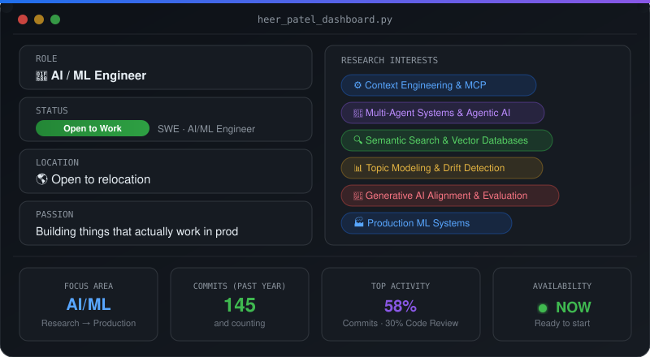
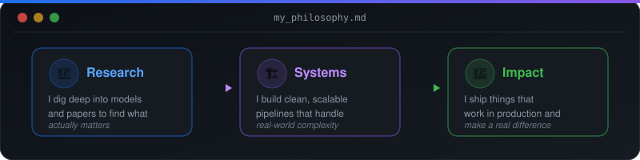

<!-- Header Banner -->

<!-- Typing SVG -->

 

<!-- Social Badges -->

  
   
  
   
  

---

## ⚡ Dashboard

  

---

## 🛠️ Tech Stack

### Languages

  
  

### ML / AI Frameworks

  
  
  
  
  
  

### Systems & Architecture

  
  
  

### Tools & DevOps

  
  
  
  

---

## 🧠 What I'm About

  

---

### 💬 Let's Connect!

*I'm actively looking for **full-time SWE or AI/ML Engineer** roles.*
*If you're building something interesting with AI, I'd love to chat.*

 

 

<!-- Footer Wave -->

